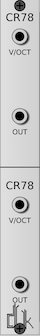
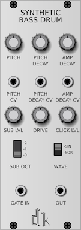
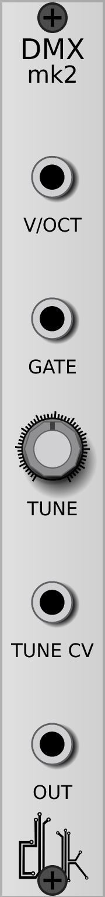
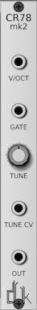

# DrumKit

Drum Modules for VCVRack.

## Modules

### BD-9


16 bass drums based on the TR909.

### Snare-N


16 snare drums based on the Novation Drumstation.

### Closed HiHats


15 closed high hats.

### Open HiHats


14 open high hats.

### DMX


Full DMX Kit, starting at Octave 4, C#, and continuing for 12 steps.

Anything above/below this will not trigger a note.  If a note is triggered, it
will not trigger again until a note out of range is sent.

### CR78



CompuRhythm-78 Kit, starting at Octave 4, C#, and continuing for 7 steps.

Anything above/below this will not trigger a note.  If a note is triggered, it
will not trigger again until a note out of range is sent.

### Synthetic Bass Drum



Synthetic Bass Drum, with a submodulator.

### DMX mk2



A less experimental version of the DMX module.  It contains a DMX kit, that is
accessible by 1 of the 12 samples via the `V/OCT` input, with Octave 4, C# as the
first.  Unlike the DMX module, it is triggered when `GATE` is brought up to or above
`1.7v`.  In addition, you can control the tone by either adjusting the `TONE`
knob, or via the `TONE CV` input.

### CR78 mk2



A less experimental version of the CR78 module.  It contains a CR78 kit, that is
accessible by 1 of the 7 samples via the `V/OCT` input, with Octave 4, C# as the
first.  Unlike the CR78 module, it is triggered when `GATE` is brought up to or above
`1.7v`.  In addition, you can control the tone by either adjusting the `TONE`
knob, or via the `TONE CV` input.

## Building

Building requires [SynthDevKit](https://github.com/JerrySievert/SynthDevKit),
which will be checked out as part of the build initialization.

```
$ git clone https://github.com/JerrySievert/DrumKit
$ cd DrumKit
$ git submodule init
$ git submodule update
$ make
```
