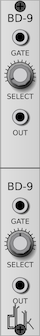
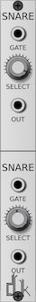
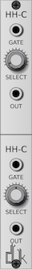
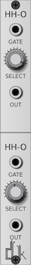
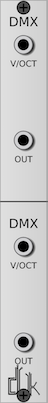

# DrumKit

Drum Modules for VCVRack.

## Modules

### BD-9



16 bass drums based on the TR909.

### Snare-N



16 snare drums based on the Novation Drumstation.

### Closed HiHats



15 closed high hats.

### Open HiHats



14 open high hats.

### DMX



Full DMX Kit, starting at Octave 5, C#, and continuing for 12 steps.

Anything above/below this will not trigger a note.  If a note is triggered, it
will not trigger again until a note out of range is sent.

This is a very experimental module.

## Building

Building requires [SynthDevKit](https://github.com/JerrySievert/SynthDevKit),
which will be checked out as part of the build initialization.

```
$ git clone https://github.com/JerrySievert/DrumKit
$ cd DrumKit
$ git submodule init
$ git submodule update
$ make
```
