---
title: "DrumKit Manual"
author: [Jerry Sievert]
date: "2019-07-14"
subject: "DrumKit"
keywords: [DrumKit, VCVRack, Manual]
lang: "en"
titlepage: true
logo: "images/drumkit.png"
...
# Welcome to DrumKit

DrumKit is a selection of drum focused modules for VCVRack.  It features a
collection of carefully curated samples along with synthesized drum modules to
bring you a fantastic drumming experience.  DrumKit is developed and maintained
for you for free.  If you like DrumKit and are feeling generous, [donations](https://paypal.me/JerrySievert)
are happily accepted (don't worry, donation money goes toward hand-crafted microbrew beer).

If you run into problems, feel free to open an [issue](https://github.com/JerrySievert/DrumKit/issues).

# DrumKit Standards

DrumKit adheres to a set of standards used across its modules.  Every effort is
taken to provide you a consistent experience.

## Gates/Triggers

Gates and triggers are configured to accept any voltage at or above `0.5 volts`.  This
means that as soon as the voltage hits `0.5 volts`, the gate is considered to be
open.  In the case of drum modules, this is when the sample or synthesis starts.
In the instance of `reset`, this is the voltage at which the module is fully
reset.

Outputs from modules that produce a gate or trigger, such as _Gnome_ or _Drum Sequencer_,
output a voltage of `5.0 volts`.  This is meant to help DrumKit modules be as
compatible as possible with other modules without the need for an attenuator.

## Envelopes

Envelope inputs for DrumKit expect a voltage of `0-5 volts`.  This allows DrumKit
to work with other envelope generators.  If you are using other envelope generators
that provide different voltages, you may need to use an attenuator.

Envelopes generated by DrumKit modules, such as _Baronial_, output `0-5 volts`.

## CV

DrumKit provides CV input for most parameters using an input voltage of `-10 volts`
to `10 volts`.  These are additive values on top of the position of the parameters,
and for the most part are meant to be proportional.  This means that if a parameter
adjusts between `0` and `5`, that it will be affected by `1` for every `2 volts`
sent to the CV input; if the parameter is set to `2`, and you provide `3 volts` via
CV then the parameter will be considered to be at `3.5`.  Alternately, if you provide
negative voltage, it subtracts at the same rate.  Note that limiters are in place
to make sure that values stay within the expectations of the modules.

# Sample Based Modules

Some modules provided by DrumKit are sample based.  This means that there are
recordings of drum sounds that are played back and manipulated as part of the
modules.  These modules allow for sample selection, as well as tuning, both with
knobs and with CV.

All sample based modules provide for two modules in one - each top and bottom module
operate independently of each other, otherwise are exactly the same.

## Snare Drum N

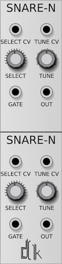

_Snare Drum N_ is a snare drum module based on the _Novation Drumstation_.  It features
16 snare samples for you to select from.

## Bass Drum 9

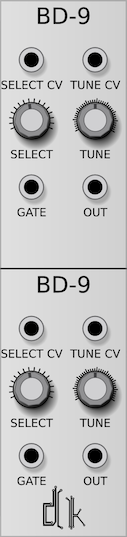

_Bass Drum 9_ is a bass drum module based on the venerable _909_.  It features 16 bass
drum samples.

## Closed HiHat

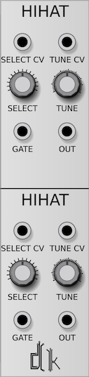

_Closed HiHat_ features 15 hihat samples.

## Open HiHat

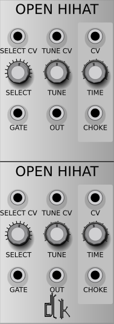

_Open HiHat_ features 14 hihat samples, but also includes a _choke_ feature.

A _choke_ of an open hihat is typically done by muffling the hihat with your hand
after it is struck.  With the _Open HiHat_ module, you have a _choke_ input that
acts as a gate, and a _time_ parameter this is also CV controllable.  The _time_
parameter acts as a decay timer for how fast the hihat is choked.  This ranges from
`0.05 seconds` to `0.5 seconds`.  The CV input adds to this range as a proportional
value: each `1 volt` input from the CV increments the value by `0.25 seconds`.

Note that if the _choke_ is triggered multiple times, it will open the sample back
up before choking it again.  This can be manifest as a "wobble" or "echo" effect,
depending on the sample that was triggered.

## Tomi

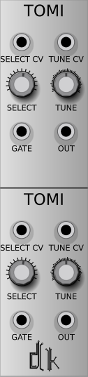

_Tomi_ features 14 tom samples, with a range of low, mid, and high toms.

## CR78

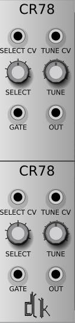

_CR78_ is based on the CR78 Drum Machine.  It features 7 samples directly from the
kit.

## DMX

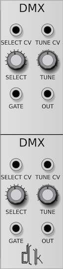

_DMX_ is based on the DMX Drum Machine, featuring 12 samples directly from the kit.

# Synthesized Modules

DrumKit includes some synthesized modules that use oscillators and envelopes to generate
their sounds.  These modules are built to provide different drum experiences all
within the same module.

## Synthetic Bass Drum

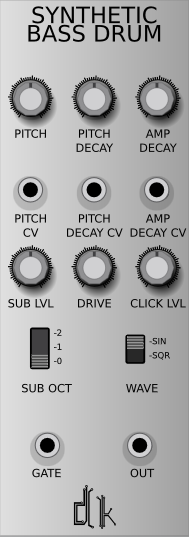

_Synthetic Bass Drum_ provides a basic sine wave oscillator coupled with a sub-oscillator
as the main sound creation.  There are three envelope variables that can be altered either
by a knob or as CV: _Pitch_ which alters the overall pitch of the oscillators,
_Pitch Decay_ which changes the speed at which the pitch drops as the drum releases,
and _Amp Decay_ which alters how fast the volume fades to zero.

In addition, there is a _Drive_ parameter that affects the overall volume, allowing
you to drive the drum into distortion.  The _Click_ parameter affects the initial
"hit" or "click" sound at the beginning of the drum, from when the drum would have
been struck.

The sub-oscillator adds an additional punch to the drum itself, and provides you
three parameters: _Sub Level_ which alters the volume of the mix of the sub-oscillator,
_Sub Octave_ which changes the octave drop of the sub-oscillator from `0` to `-2`, and
the _Wave_ which allows you to choose from a Sine Wave or a Square Wave as the base
oscillator.

## Marionette Bass

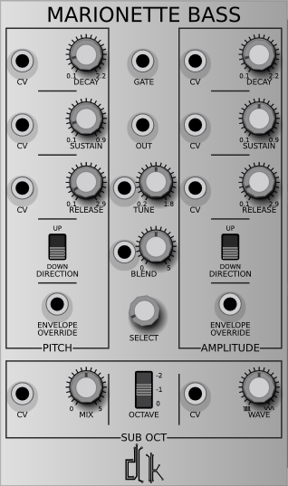

_Marionette Bass_ is the first in a line of *hybrid* modules.  It takes a mix of
curated samples and synthesized drums to generate a punchy and unique drum sound.

There are two envelopes: _Pitch_ and _Amplitude_ that control the basics of the
shape of the sound.  Each one has four parameters: _Decay_, _Sustain_, _Release_, and
_Direction_.  These envelopes can be overridden completely using the _Envelope Override_
inputs, allowing you to use any envelope generator you want to help generate the
sounds you desire.

The sub-oscillator is very similar to the one provided by the _Synthetic Bass Drum_,
but instead of having a direct wave selection, a knob and CV are provided to give
you a smooth transition between the two waveforms: square and sine.

As with the other modules, a _Tune_ parameter is provided, but _Marionette Bass_
also provides _Select_ and _Blend_, which allow you to select from a curated bass
drum sample (currently two), and blend that with the generated drum sound.  Note
that the tuning applies equally to both drums.

# Envelope Generator

The creation of _Marionette Bass_ was served well by the creation of a drum-focused
envelope generator.  DrumKit has made this envelope available as a standalone
module for your use.

## Baronial

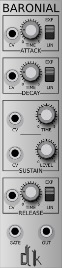

Baronial is an envelope generator made specifically for drums.  Baronial allows you
to have precise control over the attack, sustain, and release stages of the envelope.
This gives you the ability to fully control all aspects of the drums you are working
with.

# Clock Generator

There are other clock generators available, but DrumKit provides one that is
customized from drum applications.

## Gnome

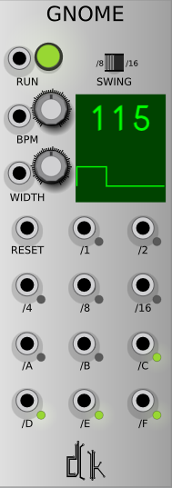

_Gnome_ is a drum focused clock generator giving you the ability to set the BPM
along with the pulse width.  In addition to the standard note outputs: `whole`,
`half`, `quarter`, `eighth`, and `sixteenth`, _Gnome_ gives you *swing* outputs
that conform to the Linn Drum swing timings.

|Output|Timing|
|------|------|
| A    | 50%  |
| B    | 54%  |
| C    | 58%  |
| D    | 62%  |
| E    | 66%  |
| F    | 71%  |

These timings can be triggered as either `eighth` or `sixteenth` notes, selectable
via the `Swing` switch.

# Sequencer

Sometimes you need a drum focused sequencer.  DrumKit provides one.

## Drum Sequencer

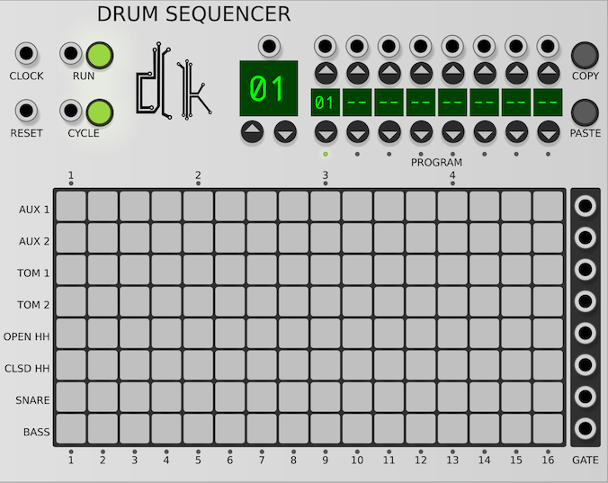

_Drum Sequencer_ is a pattern based sequencer giving you `16` patterns and up to
`8` programs for `8` gates.  These patterns can be combined and cycled through in
any order, and can be changed on the fly either manually using the buttons or
via CV.  In addition to _Cycle_ mode, _Drum Sequencer_ allows you to stay on a
single pattern and live edit your drum sequences.
